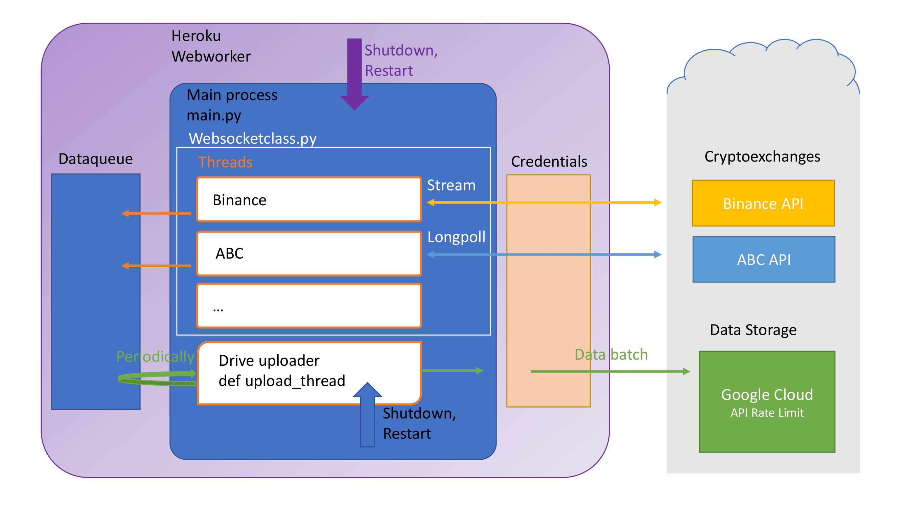

This is a hobby project done during highschool years. 
Data of 10 Crypto Exchanges has been accumulated for 1 year and 1 month,  until Google put a limit to the previously unlimited .gsheet files
  
Here a schema of the Project. 
The worker was running on the Heroku platform.  

  
## Things I learned
- The Python - API provided by Google Drive has a memory leak (After a couple of hours, the Heroku platform would throw me a "memory-limit exceeded" error and shut down the worker process)
so I had to write my own, accessing the Google Drive OData endpoints
- Handling the Heroku shutdown, restart signals(Uploading on those signals)
- Handling new day - new file, and creating new file when new the excel exceeded 500k rows
- Handling Drive API errors, making sure the Crypto Exchange API endpoints do not shut down
- Making sure marker rows would be inserted when the Crypto APIs or the Drive API would throw an error, so that later there would be no false values in the data
- Multithreading
- Working with APIs from different exchanges and creating a general class which can handle those

